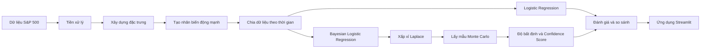

# Dự báo biến động mạnh S&P 500 và định lượng độ bất định

Đồ án nghiên cứu **Bayesian Logistic Regression (BLR)** cho bài toán dự báo biến động mạnh của chỉ số S&P 500, đồng thời định lượng mức độ bất định và độ tin cậy của từng dự báo.

Mô hình **Logistic Regression (LR)** được sử dụng làm mô hình cơ sở để so sánh với BLR.

## Tổng quan pipeline



Pipeline gồm các bước chính:

1. Thu thập dữ liệu S&P 500 giai đoạn 2015–2024 từ Yahoo Finance.
2. Tiền xử lý dữ liệu giá và khối lượng giao dịch.
3. Xây dựng 9 đặc trưng tài chính như Return, Volatility, MA Ratio, Intraday Range và Volume Ratio.
4. Xây dựng nhãn biến động mạnh bằng phân vị 80% của độ lớn lợi suất trong 126 phiên trước đó.
5. Chia dữ liệu theo thời gian với tỷ lệ 60% huấn luyện, 20% kiểm định và 20% kiểm tra.
6. Huấn luyện Logistic Regression làm mô hình cơ sở.
7. Triển khai Bayesian Logistic Regression bằng xấp xỉ Laplace và học trực tuyến Bayesian.
8. Sử dụng Monte Carlo để xây dựng phân phối dự báo hậu nghiệm.
9. Định lượng độ bất định bằng phương sai, khoảng tin cậy 95% và Confidence Score.
10. So sánh LR và BLR thông qua các chỉ số phân loại, Brier Score và Calibration Curve.

## Cấu trúc repository

```text
.
├── bayes_app/      # Ứng dụng Streamlit
├── notebooks/      # Các notebook theo từng bước của pipeline
└── README.md
```

Các notebook được chạy theo thứ tự:

```text
01 → 02 → 03 → 04 → 05 → 06 → 07
```

## Chạy ứng dụng

```bash
python -m streamlit run bayes_app/app.py
```

## Công nghệ sử dụng

`Python` · `Pandas` · `NumPy` · `Scikit-learn` · `SciPy` · `Matplotlib` · `Plotly` · `Streamlit`

## Tác giả

**Nguyễn Khắc Chí**  
Sinh viên Hệ thống thông tin quản lý, Khoa Toán – Tin, Đại học Bách khoa Hà Nội.

> Dự án được thực hiện phục vụ mục đích học tập và nghiên cứu, không phải khuyến nghị đầu tư.
